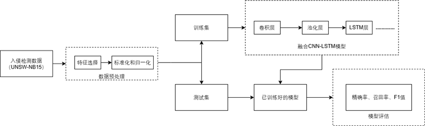

# IDS_CNN-LSTM
这一个基于数据挖掘的网络入侵检测模型，模型为融合CNN-LSTM算法模型，项目的结构为
<!-- TOC -->
* [IDS_CNN-LSTM](#ids_cnn-lstm)
  * DataSet
    * 入侵检测数据集
  * Result_img
    * 模型结果图
  * cnn_binary_model.h5
  * cnn_lstm_binary_model.h5
  * lstm_binary_model.h5
  * main.py
  * selected_features.txt
  * TestSet_Preprocessing.py
  * TrainSet_Preprocessing.py
<!-- TOC -->

项目的工作流程：

注意事项：
    需要将模型输入的数据集放在./DataSet目录下
    